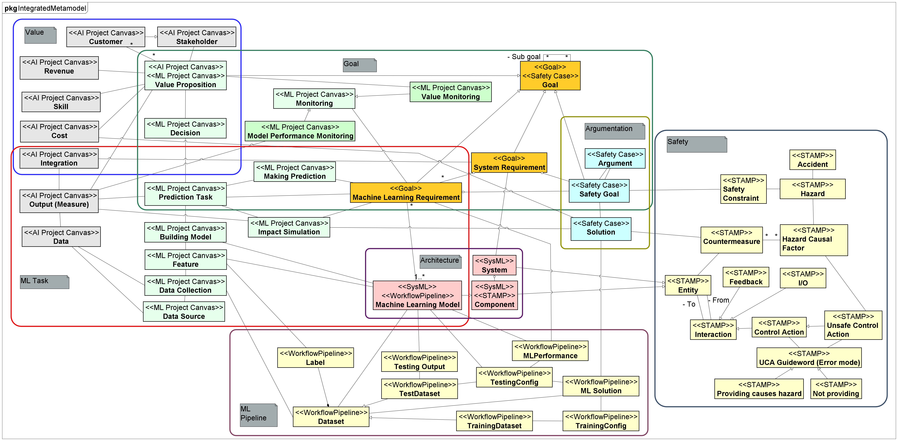

# eAI Framework Modeling Plugin
This plugin is made to facilitate the Multi-view Modeling Framework for ML System (M3S) inside Astah* System Safety.

For more information on the process, please refer to our publication: https://link.springer.com/article/10.1007/s11219-024-09687-z

## Astah* System Safety and System Requirements

This plugin is made for Astah* System Safety version 8.0.0 (https://astah.net/release-notes/system-safety-8-0/). Please refer to Astah* System Safety system requirements for the details.

Compatibility with newer versions is not guaranteed.

## Preparation

To set a network connection with the backend side, do the following:

1. Access the [SSHFramework.java](src/main/java/ai/engineering/pipeline/SSHConnector.java).
2. Set the IP address, username, password, and port in the following section:
   ```
   //Set the host IP, username, password, and port for training server
    static String host = "";
    static String user = "";
    static String password = "";
    static String port = ""
   ```
3. Set the local directory for temporary files to be stored. The default is the D drive root folder.
   ```
   //Set the local folder to hold temporary files
   static String local = "D:";
   ```
4. Compile the plugin.

## Compiling
To create your own version of the binary, follow the Astah* System Safety plugin development tutorial:

https://astah.net/support/plugin-dev-tutorial/plugin-development-setup-for-astah-system-safety/

## Installation
Installation can be done in two ways:

- Drop the .jar file into the opened Astah System Safety instance to install.
- Restart the Astah System Safety for the installation to be implemented.

OR

- From the **Plugin** menu, open **Installed Plugins...**
- Click **Install**
- Select the .jar file
- Restart the Astah System Safety for the installation to be implemented.

## Manual
More complete instructions on how to operate the plugin are available on the manual below.

[docs/manual.md](docs/manual.md)

## Integrated Metamodel
Access the [metamodel folder](https://github.com/jst-qaml/framework-modeling-tool/tree/main/metamodels) to access the integrated metamodel of M3S. Editable Astah* Professional file is also available.



## Case Study

We prepared the case study of traffic sign image classification to demonstrate how M3S works with our plugin. Please refer to [our publication](https://link.springer.com/article/10.1007/s11219-024-09687-z) for the details.

The following files are provided in the [case study folder](https://github.com/jst-qaml/framework-modeling-tool/tree/main/case%20study):

| File (.axmz)                    | Description                                     |
| ------------------------------- | ----------------------------------------------- |
| Case study                      | First version of analysis                       |
| Case study_configured_prerepair | Second version with requirements validated      |
| Case study_repair_aggresive     | Third version with aggressive repair implemented |
| Case study_repair_balanced      | Third version with aggressive repair implemented |
| Case study_update               | Final version with requirements updated         |

## Pattern Application

> [!IMPORTANT]  
> This feature requires Astah* System Safety with object constraint language (OCL) support to work. Please contact the Astah* representative for the availability of the product.

### Install
First of all, you need to install the plugin into astah* System Safety. Please visit the pattern-application branch and download it. Then, you can install it. The plugin can be installed in one of the following ways:

1. Drag and drop the plugin file onto the Astah* window.
2. Install from the "Install" button on the plugin list.

To use the installed plugins, you must restart Astah* after installation ([install the plugin in astah* System Safety official site](https://astah.change-vision.com/ja/manual-sys/reference/basic_function/plugin.html#id3)).

### Machine Learning Reliability Solution Patterns
With this plugin, you can use the following Machine Learning Reliability Solution Patterns (Table 2).

*Table 2: Extracted Machine Learning Reliability Solution Patterns*
| ID  | Pattern Name                         | Problem (Excerpt)                                                                                   | Solution (Excerpt)                                                                          |
| --- | ------------------------------------ | ---------------------------------------------------------------------------------------------------- | ------------------------------------------------------------------------------------------- |
| P1  | Selective repair                     | It is impossible to analyze the cause and consider countermeasures when deficiencies are found.      | Machine Learning repair tool                                                                |
| P2  | Adversarial example defense          | Response to malicious users (control by security attacks, misrecognition of images, falsification of learning data, etc.) is unknown. | Adversarial training                                                                        |
| P3  | Reprioritize accuracy                | Recognition of critical (important) scenes cannot be guaranteed. New training data can reduce the recognition rate. | Machine Learning repair tool                                                                |
| P4  | Training data sampling               | Large amounts of training and test data are needed to ensure reliability.                             | Data sampling method                                                                        |
| P5  | Model smoke testing                  | The cost of re-verification and retesting of safety and reliability when changing the system is high. | Smoke Testing                                                                               |
| P6  | Safeguard                            | Safe system shutdown within the warranty period cannot be guaranteed.                                | Rule-based Safety Guard Pattern                                                             |
| P7  | Security requirement satisfaction argument | Security requirements must be evaluated in a data and model-driven manner.                            | Test data or formal verification                                                            |
| P8  | DNN Robustness Case Verification Pattern | A security case based on the formal verification of robustness has yet to be verified.                | Arguments over the model verification, its inputs, and model integration into the system as a whole |

### Usage of the plugin

#### Step 1 Pattern applicability indication

First, open the pattern selection support view and activate the plug-in. If there is a pattern in the GSN diagram open at that time that can be applied, the name of the pattern and the location where it is applied will be displayed (Figure 1). In Figure 1, P1, P2, and P4 could be applied at G31, and P5 could be applied at G32.


*Figure 1: Example of Step 1 Pattern applicability indication.*

#### Step 2 Select a pattern

Selecting a pattern that was displayed in green will display the pattern application method options. Select the appropriate option from here (Figure 2). If P1 is selected in Figure 1, the result is Figure 2. In this case, there are three options: G31 matches the pattern, G31 and S3 match the pattern, or G31 and S4 match the pattern.


*Figure 2: Example of Step 2 Select a pattern.*

#### Step 3 Pattern application

Finally, the pattern is applied by selecting an option (Figure 3). If in Figure 2 the case where G31 and S4 match the pattern is selected, then Figure 3 is shown. This applied the pattern.


*Figure 3: Example of Step 3 Pattern application.*

### Conclusion

In this tutorial, we showed how to use a pattern application support framework. The above results are expected to complement engineers' prior knowledge and reduce human error.
