# Framework modeling tool (Astah plug-in)

- The language in the images is Japanese due to issues with changing Astah's language settings.
- Some screenshots from the provided videos/slides have been used.
- If any included images cannot use, please replace them as necessary.

## Details
### Compatible with
- astah System Safety
    - Version: ???

## Plugin Overview

This plugin allows you to efficiently repair ML models within Astah.
While referring to the Process Guide View, create an ML Canvas, AI Project Canvas, KAOS Goal Model, etc., and investigate under what conditions it is best to repair the ML model.
By providing a separate ML model learning mechanism in the backend, you can easily repair ML models and check the results from Astah.

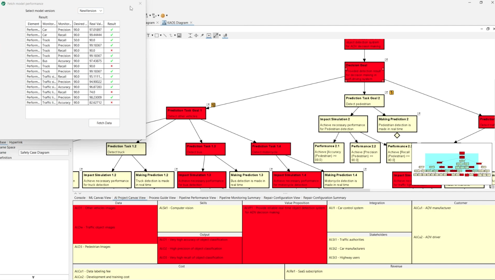

You will fill in the contents of each item in the metamodel below.

## Features

- Create an ML Canvas
- Create an AI Project Canvas
- A mechanism for repairing ML models (TODO: Break down into smaller elements)

## Installation Instructions

1. Clone the framework-modeling-tool repository.
2. Drop the .jar file in the releases into the opened Astah System Safety instance to install.
3. Restart the Astah System Safety for the installation to be implemented.
4. The installation is successful if you see ai.engineering.frameworktool in installed plugin list.

TODO: How to connect to pipeline (?)

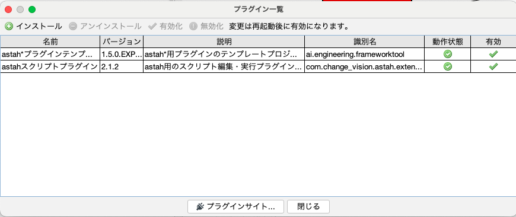

## How to use

Open the closed pane at the bottom of the screen.
Up until section 6, we will follow the steps in the Process Guide View, adding supplementary information as appropriate.

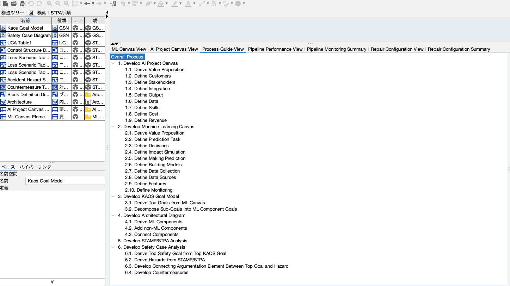

### 1. Develop AI Project Canvas

Use AI Project Canvas to analyze the project by focusing on its "Value".
There are nine items to fill in: Value Proposition, Customers, Stakeholders, Integration, Output, Data, Skills, Cost, and Revenue.
These correspond to the grey blocks in the metamodel.
(TODO: Useful links, etc.)

| | |
|---|---|
|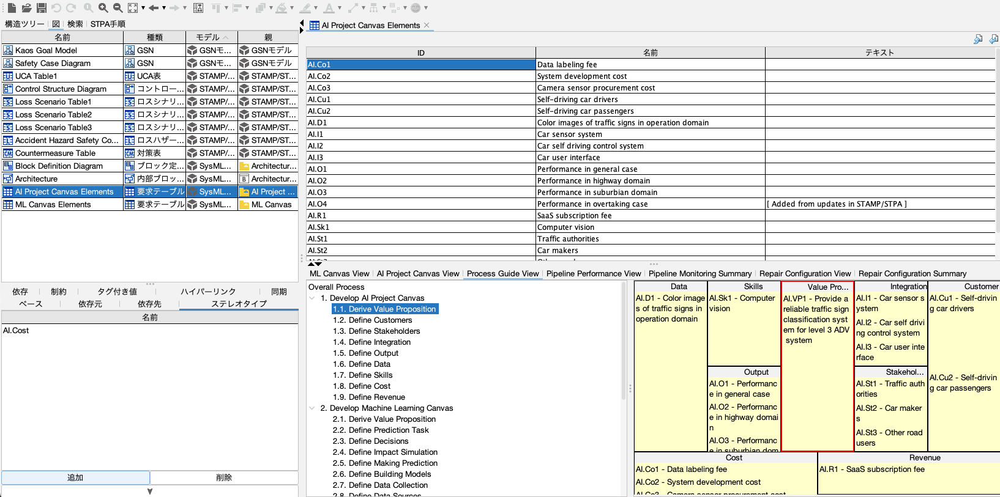| 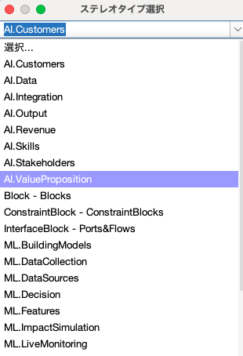|

### 2. Develop Machine Lerarning Canvas

Use the ML Model Canvas to analyze the project by focusing on the "ML Task" to be performed.
There are 10 items to fill in: Value Proposition, Prediction Task, Decisions, Impact Simulation, Making Prediction, Building Models, Data Collection, Data Sources, Features, and Monitoring.
These correspond to the green blocks in the metamodel.
(TODO: Useful links, etc.)

### 3. Develop KAOS Goal Model

Let's use the KAOS Goal Model to break it down into the "Goal" to be achieved and the requirement necessary to achieve them.
Determine the Top Goals based on the contents of the ML Canvas and break them down into the goals of the ML Component.
These correspond to the orange blocks in the metamodel.
(TODO: Useful links, etc.)

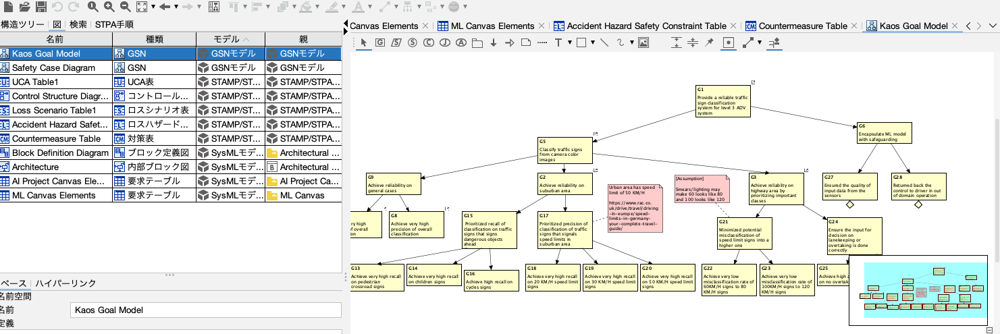

|Models created with ML Canvas can be reused|You can set conditions that ML Components must achieve|
|---|---|
|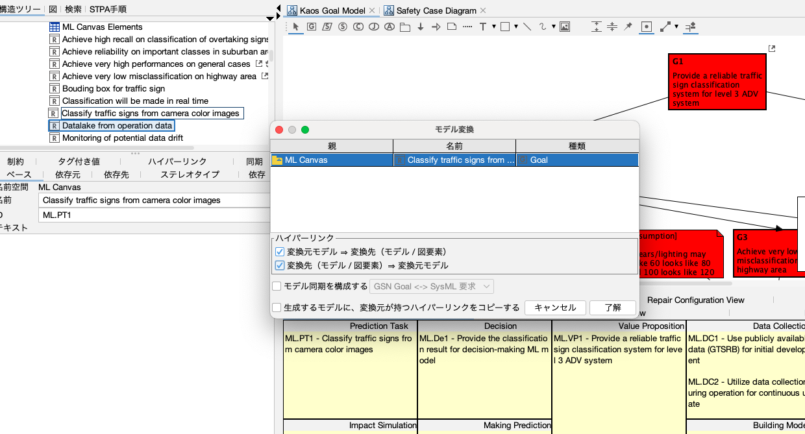 |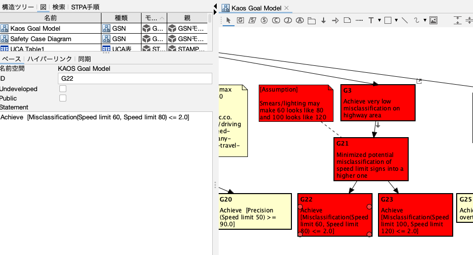|

### 4. Develop Architectural Diagram

Let's visualize the "Architecture" by enumerating and associating the necessary ML and non-ML elements to the Architectural Diagram.
These correspond to the red blocks in the metamodel.
(TODO: Useful links, etc.)

|Block definition diagram|Internal block diagram|
|---|---|
|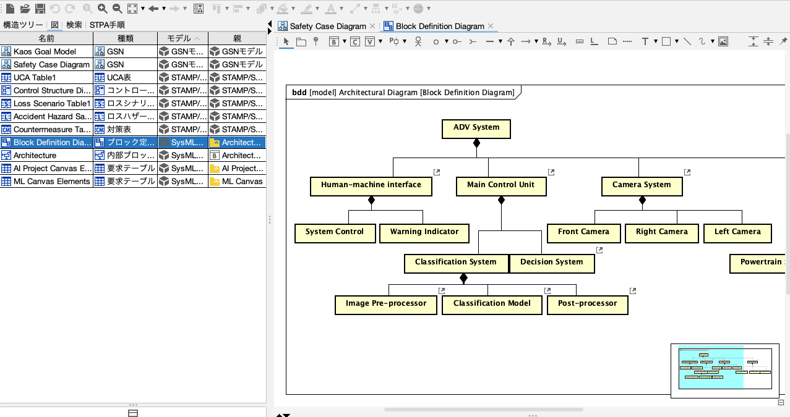 |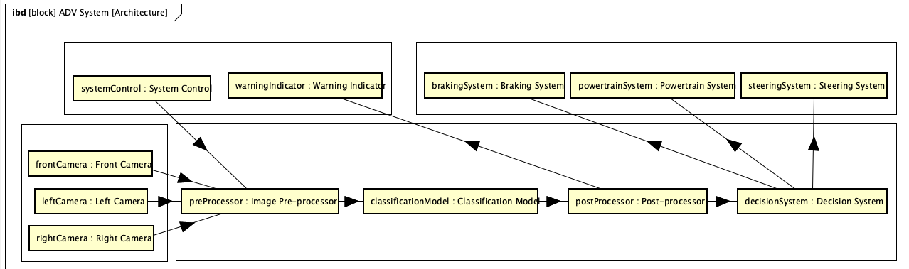|

### 5. Develop STAMP/STPA Analysis

Let's use STAMP/STPA Analysis to list which "Safety" measures we want to improve and what indicators we can use to quantify them.
For information on how to perform STAMP/STPA Analysis, please refer to the Astah official documentation, which includes tutorials.
In the metamodel, this corresponds to the yellow block on the right.

|Identification of losses, hazards and safety constraints|Building a control structure|
|---|---|
|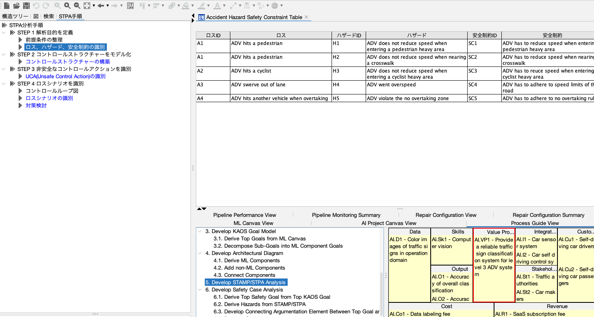|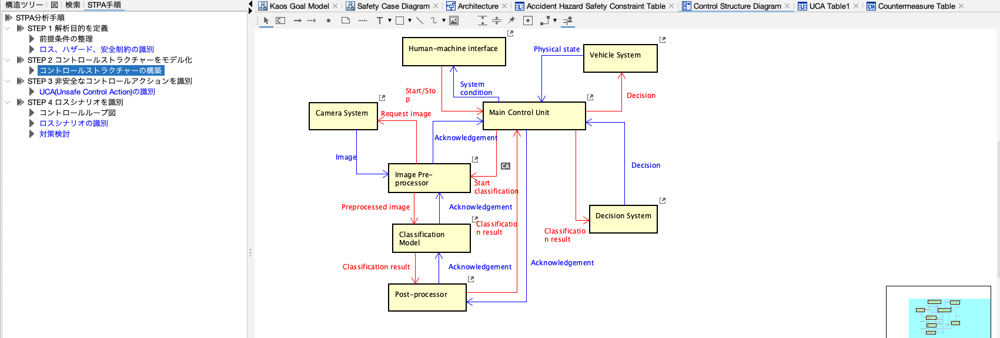|

|Unsafe Control Action (UCA) Identification |Countermeasure Consideration|
|---|---|
|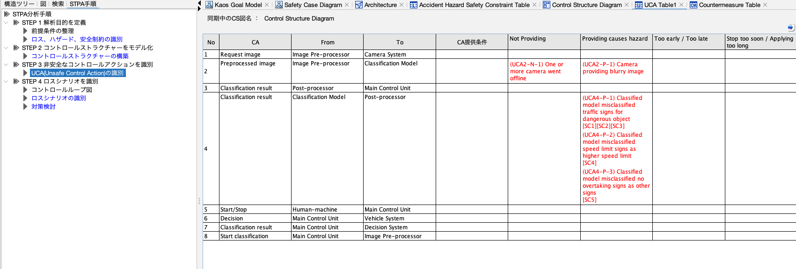|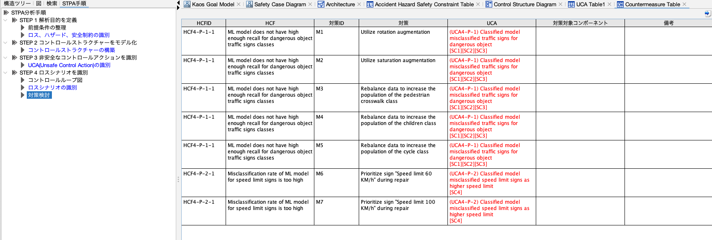|

### 6. Develop Safety Case Analysis

Let's use the KAOS Goal Model to consider how to "strengthen" the safety of ML models.
These correspond to the blue blocks in the metamodel.

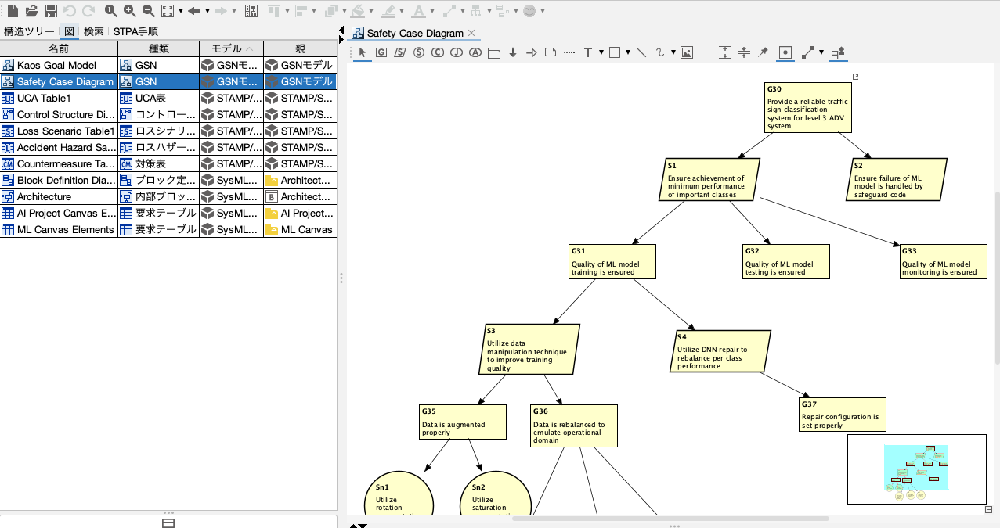

### 7. eAI Framework tools

In this section, we will finally train and repair the ML model.
We will introduce the five items in this image.
Please note that some tools require connection to backend.
In the metamodel, these correspond to the yellow blocks at the bottom.

### 7.1. Train and Test ML models (Requires connection to backend)

Train a new version of ML model at server.
The input items at the top are the parameters of the new version of the ML model.
Click the button below to start training at backend.

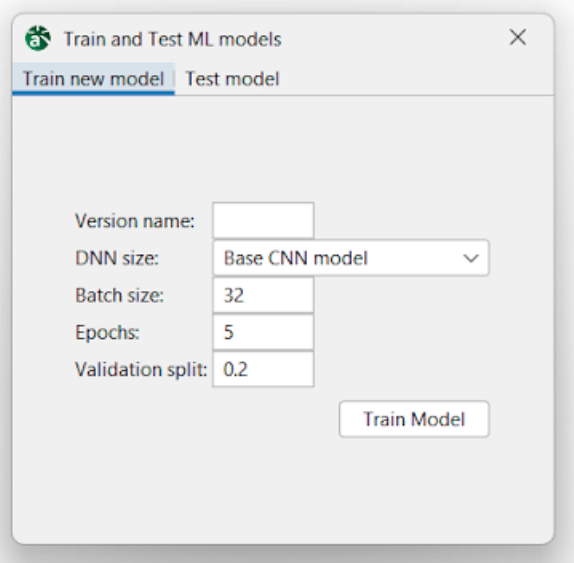

### 7.2. Fetch model performance (Requires connection to backend)

Retrieve ML performance test data and propagate red color (indicating failure) from goals with failed expected performance. 

|Before fetch|After fetch|
|---|---|
|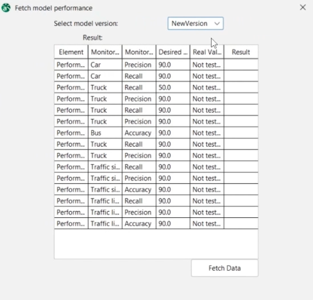| |

### 7.3. Propagate Test Evidence

To propagate red color (indicating failure) from justification node indicating failure.
(TODO: Attach a proper image)

### 7.4. Repair ML Model (Requires connection to backend)

Execute DNN repair using configured repair configuration. 
In the New model name field, you can set the New Name for repaired version of ML Model.
In the Base model version field, you can set the List of existing version of ML model to be used as the base.
In the Existing configuration field, a list of repair configurations is displayed.
Press the Repair button at the bottom to start the repair process at backend.

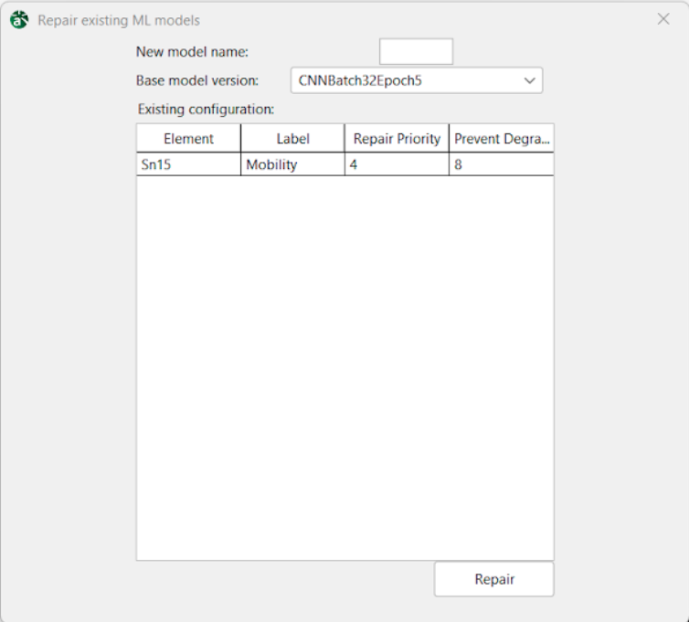

Repair configurations can be set/checked in the following view:
|Repair Configuration View (Set a solution node as repair configuration.)| Repair Configuration Sumamry (Summary of DNN repair configurations.)|
|---|---|
|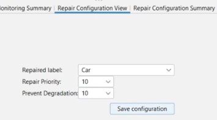 |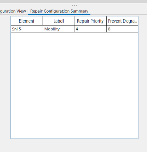|

And if an item that was originally below the target value now exceeds the target value after repair is performed, it will no longer be marked red.

|Before Repair|After Repair|
|---|---|
|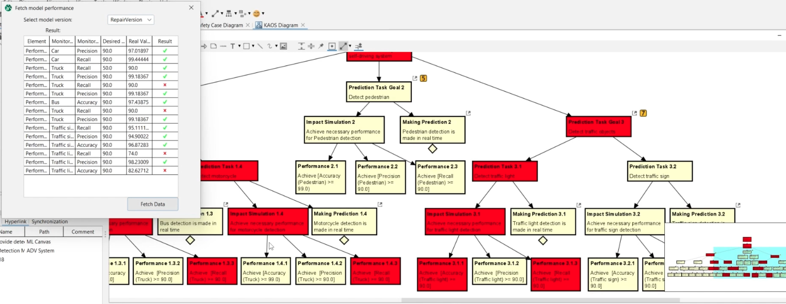|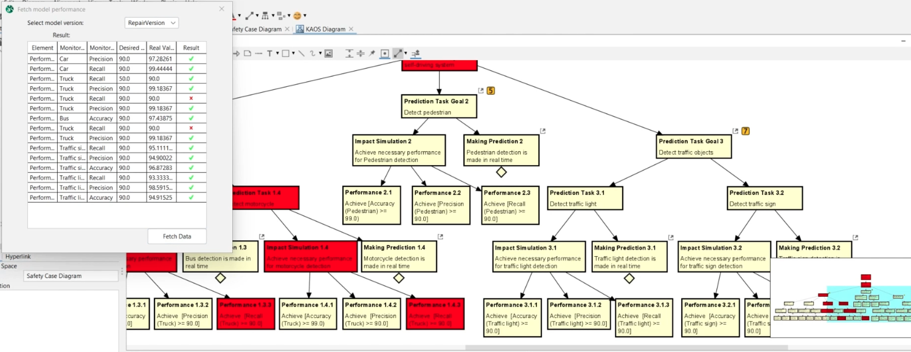|

### 7.x. Pipeline View

TODO: Detailed explanation.

|Pipeline Performance View(Setting Expected Performance of a goal.)|Pipeline Monitoring Summary(Summary of expected performances sets.)|
|---|---|
|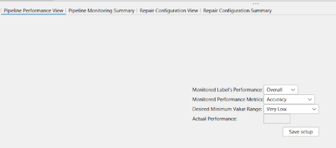 |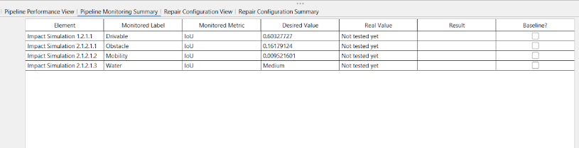|
