# Framework modeling tool (Astah plug-in)

- 画像の大きさは、後程調整します。
- 画像中の言語が日本語なのは、Astahの言語設定変更方法が動かないためです。

## Details
### Compatible with
- astah System Safety
    - Version: ???

## Plugin Overview

本プラグインは、astah内でMLモデルのrepairを効率的に行うためのプラグインです。
Process Guide Viewを参照しながら、ML Canvas, AI Project Canvas, KAOS Goal Modelなどを作成していき、どのような条件でMLモデルを修正すると良いかを調査していきましょう。
バックエンドに別途MLモデルの学習機構を用意することで、astah上からMLモデルの修正と結果の確認を容易に行えます。

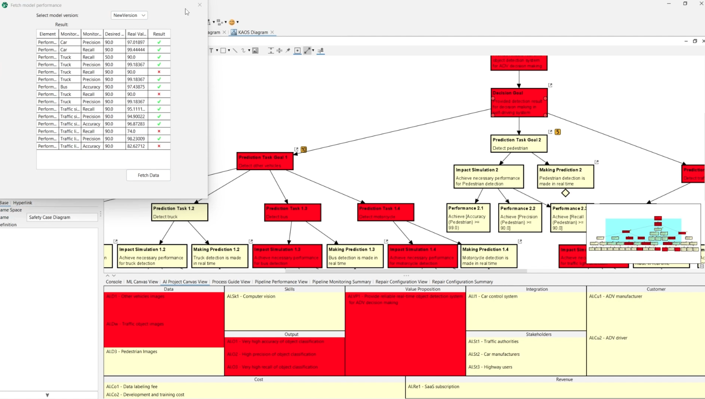

## Features

- ML Canvasを作成する
- AI Project Canvasを作成する
- MLモデルをrepairする仕組み (TODO: より細かい要素に分解する)

## Installation Instructions

1. Clone the framework-modeling-tool repository.
2. Drop the .jar file in the releases into the opened Astah System Safety instance to install.
3. Restart the Astah System Safety for the installation to be implemented.
4. The installation is successful if you see ai.engineering.frameworktool in installed plugin list.

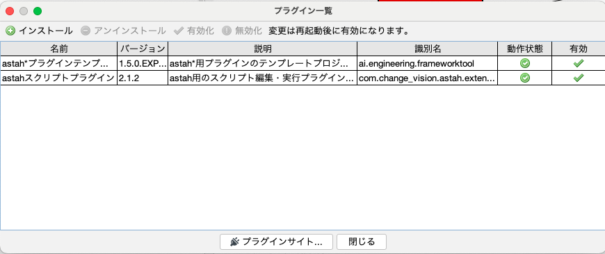

## How to use

画面下部に閉じているペインがあるので、それを開いてください。
本節では、Process Guide Viewの手順に従いながら、適宜補足情報を追加していきます。

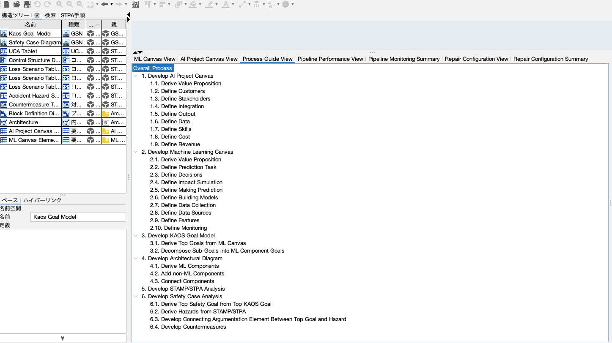

### 1. Develop AI Project Canvas

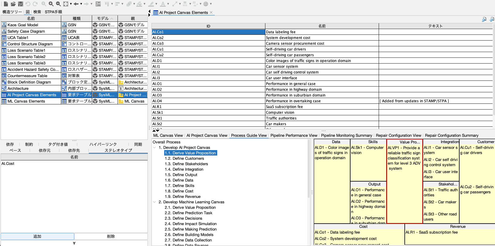
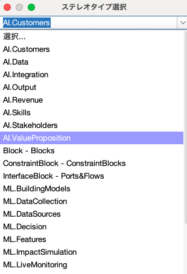

### 2. Develop Machine Lerarning Canvas

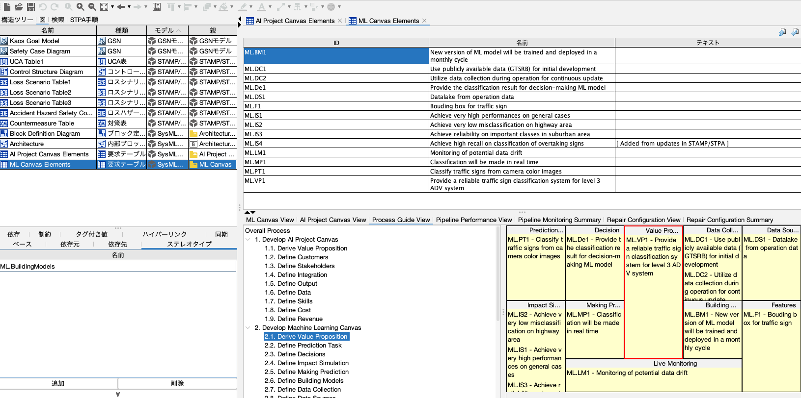

### 3. Develop KAOS Goal Model

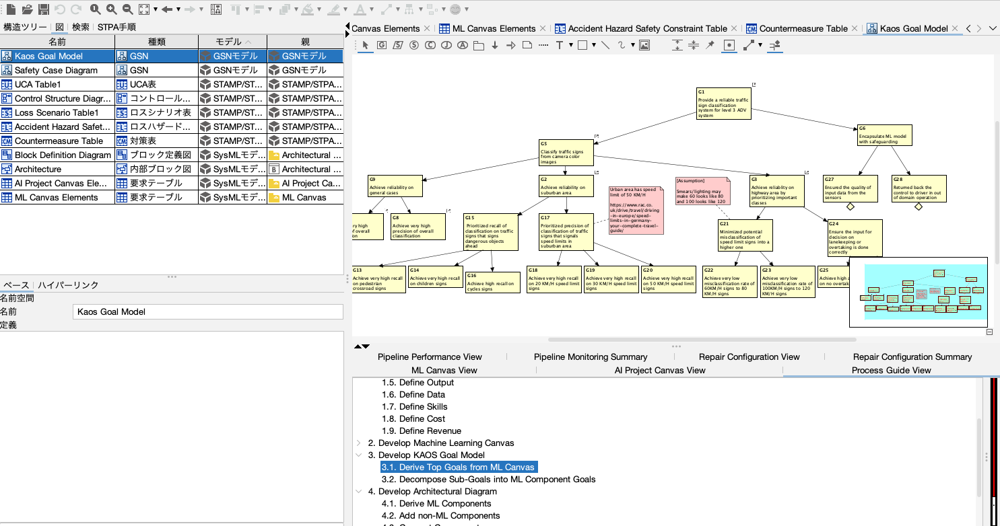
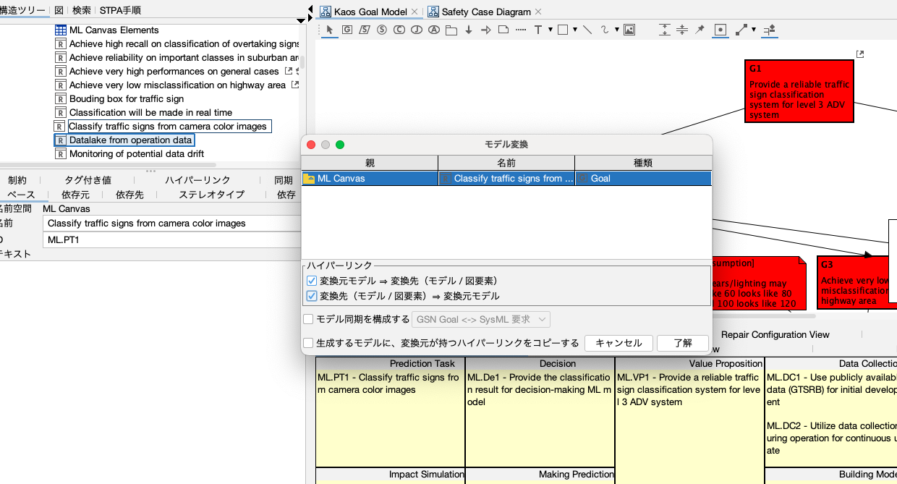
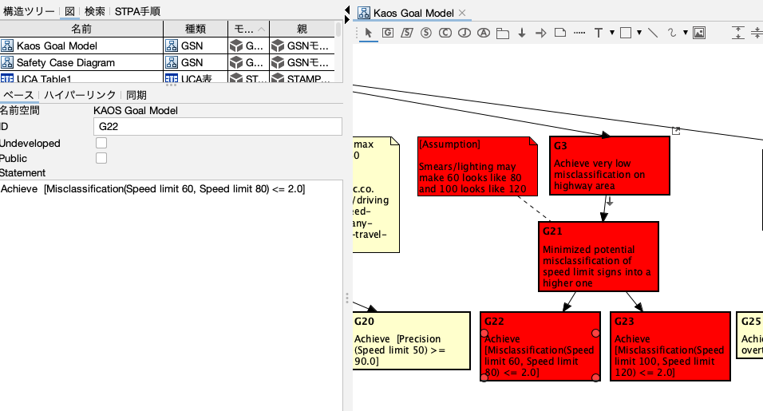

### 4. Develop Architectural Diagram

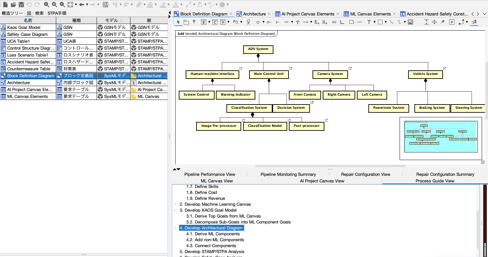
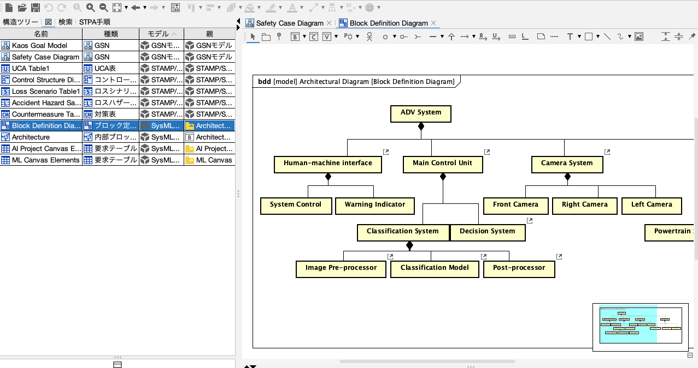

### 5. Develop STAMP/STPA Analysis

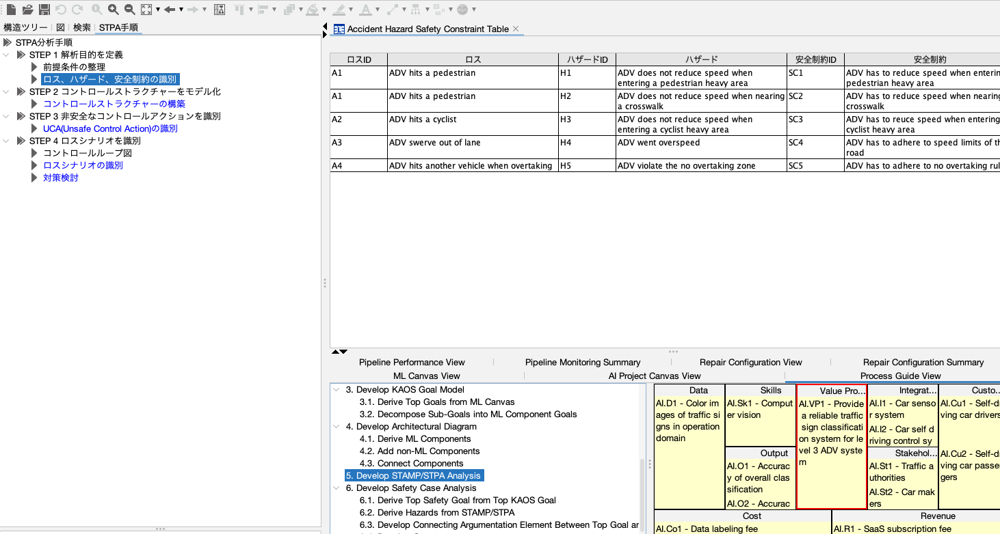

### 6. Develop Safety Case Analysis

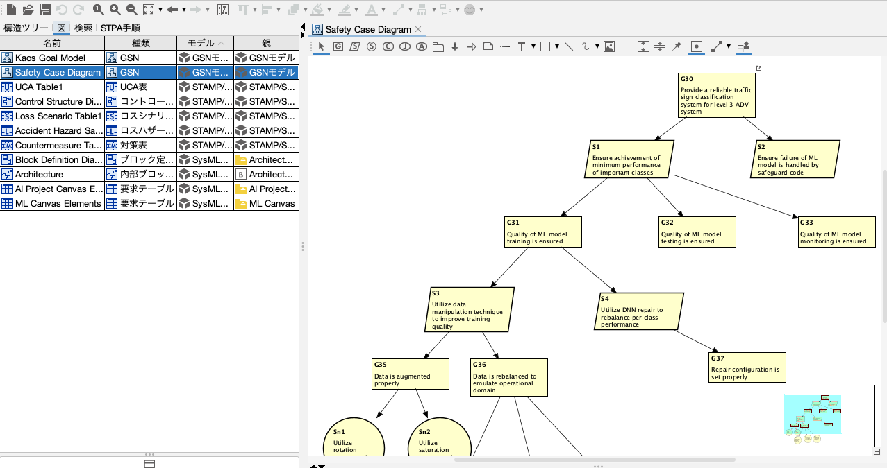

### 7. Title is unknown

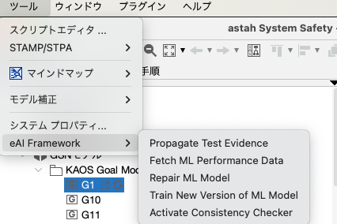

### 7.x. Train and Test ML models
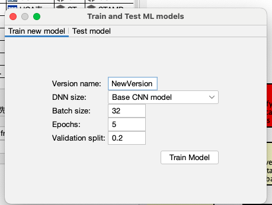

### 7.x. Fetch model performance
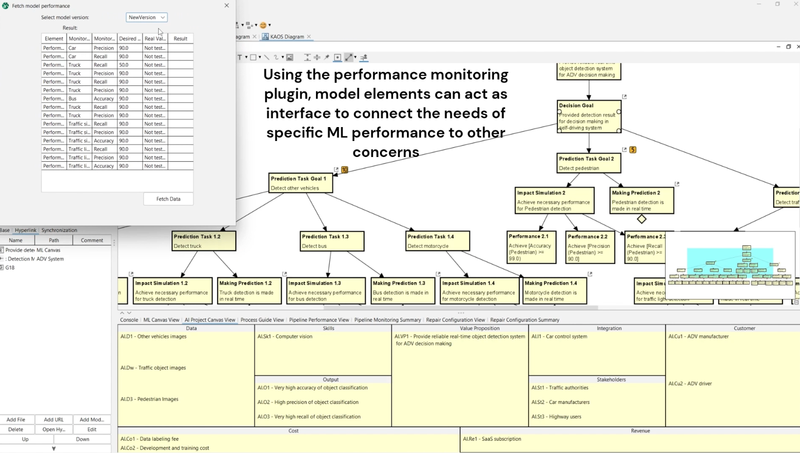

### 7.x Repair Configuration View
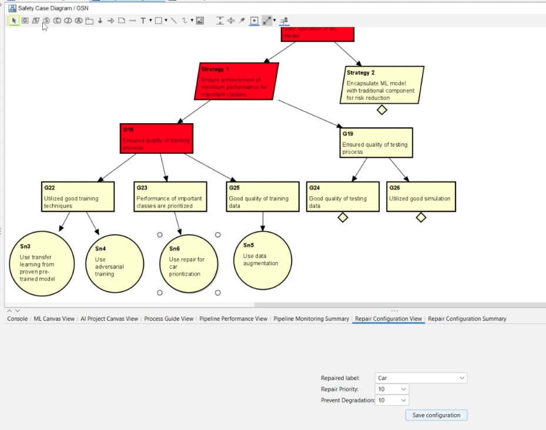
