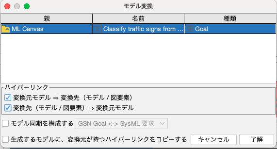
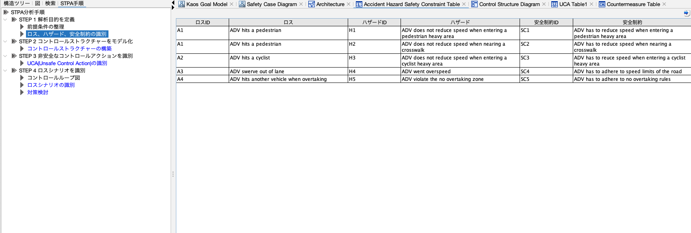

# Framework modeling tool (Astah plug-in)

- 画像中の言語が日本語なのは、Astahの言語設定変更方法が動かないためです。
- ご提供いただいた動画/スライドについて、一部スクリーンショットで使用しております。

## Details
### Compatible with
- astah System Safety
    - Version: ???

## Plugin Overview

本プラグインは、astah内でMLモデルのrepairを効率的に行うためのプラグインです。
Process Guide Viewを参照しながら、ML Canvas, AI Project Canvas, KAOS Goal Modelなどを作成していき、どのような条件でMLモデルを修正すると良いかを調査していきましょう。
バックエンドに別途MLモデルの学習機構を用意することで、astah上からMLモデルの修正と結果の確認を容易に行えます。

前半は、以下のメタモデルの各項目の内容を埋めていくように進めます。

## Features

- ML Canvasを作成する
- AI Project Canvasを作成する
- MLモデルをrepairする仕組み (TODO: より細かい要素に分解する)

## Installation Instructions

1. Clone the framework-modeling-tool repository.
2. Drop the .jar file in the releases into the opened Astah System Safety instance to install.
3. Restart the Astah System Safety for the installation to be implemented.
4. The installation is successful if you see ai.engineering.frameworktool in installed plugin list.

TODO: pipelineと接続する手順 (?)

## How to use

画面下部に閉じているペインがあるので、それを開いてください。
本節の前半では、Process Guide Viewの手順に従いながら、適宜補足情報を追加していきます。

### 1. Develop AI Project Canvas

AI Project Canvasを用いて、そのプロジェクトの「価値」にフォーカスして分析しましょう。埋める項目は、Value Proposition, Customers, Stakeholders, Integration, Output, Data, Skills, Cost, Revenueの9項目です。
metamodelでは灰色のブロックに対応します。
(TODO: 有用なリンク等)

| | |
|---|---|
|| |

### 2. Develop Machine Lerarning Canvas

ML Model Canvasを用いて、そのプロジェクトにおいて実施する「ML Task」にフォーカスして分析しましょう。埋める項目は、Value Proposition, Prediction Task, Decisions, Impact Simulation, Making Prediction, Building Models, Data Collection, Data Sources, Features, Monitoringの10項目です。
metamodelでは緑色のブロックに対応します。
(TODO: 有用なリンク等)

### 3. Develop KAOS Goal Model

KAOS Goal Modelを用いて、達成すべき「目標」と、そのために必要な「要件」に分解していきましょう。ML Canvasの内容を踏まえてTop Goalsを求めて、ML Componentの目標へと分解していきましょう。
metamodelでは橙色のブロックに対応します。
(TODO: 有用なリンク等)

|ML Canvasで作成したモデルは再利用できる|ML Componentが達成すべき条件を設定できる|
|---|---|
| ||

### 4. Develop Architectural Diagram

Architectural Diagramに対して、必要なML要素や非ML要素を列挙/関連付けていき、「構造」を可視化しましょう。
metamodelでは赤色のブロックに対応します。
(TODO: 有用なリンク等)

|ブロック定義図|内部ブロック図|
|---|---|
| ||

### 5. Develop STAMP/STPA Analysis

STAMP/STPA Analysisを用いて、どのような「問題」が起きる可能性があり、どのような「指標」を用いることで解決/未解決かを判定できるのかを列挙していきましょう。STAMP/STPA Analysisをどのように行うのかについては、Astahの公式ドキュメントにチュートリアルなどが載っていますので参照してください。
metamodelでは右側の黄色のブロックに対応します。

|ロス、ハザード、安全制約の識別|コントロールストラクチャーの構築|
|---|---|
|||
|UCA(Unsafe Control Action)の識別|対策検討|
|||

### 6. Develop Safety Case Analysis

KAOS Goal Modelを用いて、MLモデルの安全性を「強化」するためにはどうすれば良いかを検討していきましょう。
metamodelでは青色のブロックに対応します。

### 7. eAI Framework tools

この項目ではついに、MLモデルの学習とrepairを行っていきましょう。
この画像中の5つの項目を紹介していきます。
一部のツールはRequires connection to backendなので注意してください。
metamodelでは下側の黄色のブロックに対応します。

### 7.x. Train and Test ML models (Requires connection to backend)

Train a new version of ML model at server.

上にある入力項目は、Parameters of new version of ML modelです。
下のボタンを押すことで、start training at backend.

### 7.x. Fetch model performance (Requires connection to backend)

Retrieve ML performance test data and propagate red color (indicating failure) from goals with failed expected performance. 

|Before fetch|After fetch|
|---|---|
|| |

### 7.x. Propagate Test Evidence

To propagate red color (indicating failure) from justification node indicating failure.
(TODO: 適切な画像の添付)

### 7.x. Repair ML Model (Requires connection to backend)

Execute DNN repair using configured repair configuration. 

New model nameの項目では、New Name for repaired version of ML Modelが設定できます。
Base model versionの項目ではList of existing version of ML model to be used as the baseが設定できます。
Existing configurationの項目ではList of repair configurationsが表示されます。
一番下のRepairのボタンを押すことで、start repair process at backend。

Repair configurationsは、以下のViewで設定/確認が可能です。
|Repair Configuration View (Set a solution node as repair configuration.)| Repair Configuration Sumamry (Summary of DNN repair configurations.)|
|---|---|
| ||

### 7.x. Pipeline View

TODO: 詳細な説明。

|Pipeline Performance View(Setting Expected Performance of a goal.)|Pipeline Monitoring Summary(Summary of expected performances sets.)|
| ||
